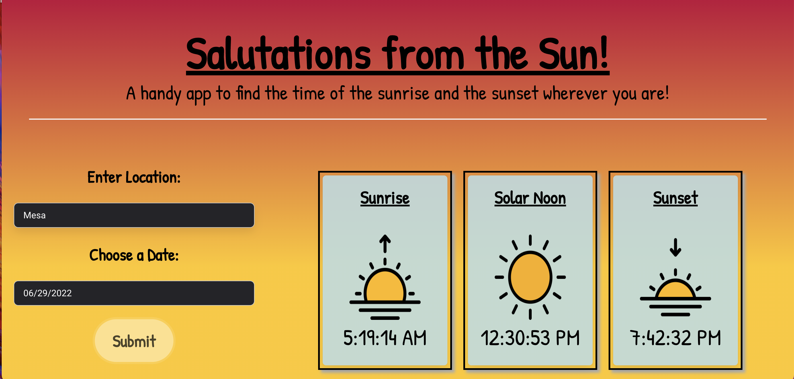

# salutations
# Project 1 Team Venus

# Purpose 
So you never have to miss a sunset or a sunrise again. This interactive app will let a user know the exact time for the sunrise and/or sunset in their location with just a click of a button.   

# User-Objective 
- On click the user will be able to search for their location and select the date for sunrise/sunset.
- After the user enters information and clicks the submit button this application will dynamically display the results for the user in a sleek and responsive UI. 

# Features 
* HTML 
* CSS
* JavaScript
* Bulma
* Mobiscroll
* Web-Apis:
    - http://api.openweathermap.org to call location coordinates

    - https://sunrise-sunset.org/api to call sunrise and sunset times
    

# Snapshoot of Demo

# Team Venus Websites 
* Github: https://github.com/krsparks2/salutations
* Deployed: https://krsparks2.github.io/salutations/

# Contributors 
- Lea Bryant, ldbryant3220@gmail.com
- Tracy Rose Guajardo, tracyroseguajardo@gmail.com
- Keli-Rene Sparks, krsparks2@yahoo.com